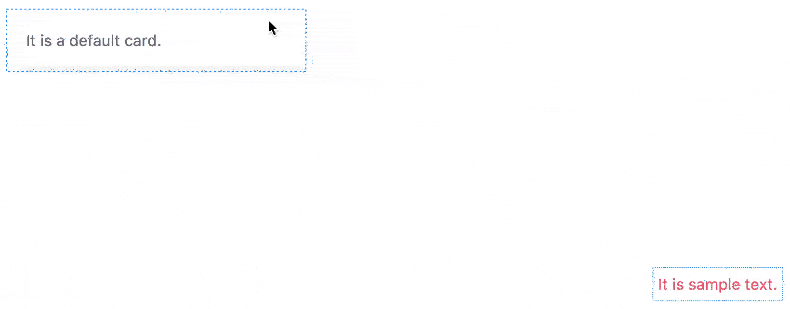

# uk-rope
The component is used to rope DOM element(s)



## Installation

```
$ npm install --save uk-rope
```

## Usage

```
<!--
options: {
    target: Array, [e.g: ["#id", ".class"]]
    padding (optional): Number, [default: 10]
    stroke-width (optional): Number, [default: 1]
    stroke-color (optional): String, ["default" or "success" or "warning" or "danger" or HEX value]
    stroke-dashed (optional): Boolean [default: true]
}
event: [
    {
        name: "show-handle",
        description: "When mouse enter the rope, will fire the event.",
        arguments: {
            x: "X coordinate of handle relative to positioned ancestor",
            y: "Y coordinate of handle relative to positioned ancestor"
        }
    },
    {
        name: "move-handle",
        description: "When mouse move on the rope, will fire the event.",
        arguments: {
            x: "X coordinate of handle relative to positioned ancestor",
            y: "Y coordinate of handle relative to positioned ancestor"
        }
    },
    {
        name: "fix-handle",
        description: "When mouse down on the rope, it will fix the handle and fire the event.",
        arguments: {
            x: "X coordinate of handle relative to positioned ancestor",
            y: "Y coordinate of handle relative to positioned ancestor"
        }
    },
    {
        name: "pull-handle",
        description: "When mouse drag on document, the handle will also be fixed and fire the event.",
        arguments: {
            x: "X coordinate of mouse movement",
            y: "Y coordinate of mouse movement"
        }
    },
    {
        name: "loose-handle",
        description: "When stop to drag mouse on document, will fire the event.",
        arguments: {
            id: "The fixed handle id"
        }
    },
    {
        name: "drag-handle-start",
        description: "When start to drag a fixed handle, will fire the event.",
        arguments: {
            id: "The fixed handle id"
        }
    },
    {
        name: "drag-handle",
        description: "When drag the fixed handle, will fire the event.",
        arguments: {
            x: "X coordinate of fixed handle",
            y: "Y coordinate of fixed handle"
        }
    }
]
-->
<div id="app">
    <div class="uk-card uk-card-body uk-card-default">
        It is a default card.
    </div>
    <uk-rope :target="['.uk-card']"></uk-rope>
</div>
```

```
import Vue from "vue";
import UkRope from "uk-rope";

Vue.component("uk-rope", UkRope);
new Vue({
    el: "#app"
});
```

## Local test

1. Clone repository.

    ```
    $ git clone git@github.com:vue-kit/uk-rope.git
    ```

2. Install dependencies.

    ```
    $ npm install
    ```

3. Run test page with hot reload at localhost:8080.

    ```
    $ npm test
    ```
